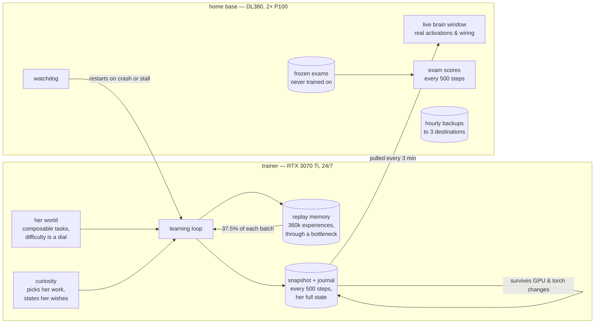

# Amber

**A lifelong-learning agent, built measurement-first.**

*The window is live: columns are her twenty layers (32 measured channel groups
each), the waves are single written characters, the wiring colors are read
from her actual weights, and the panels show the world she has opened up and
her exam scores over the run.*

Amber is a from-scratch experiment in continual learning: one small
transformer (35.6M parameters) that lives on a single machine for months,
keeps learning new material without forgetting the old, survives restarts
bit-for-bit, picks her own work, and says out loud what she wants to practise
next.

This is not a frozen LLM with a database bolted on. The core learns — its
weights change every step — and everything around it exists to *measure*
whether that works.

## What is here

| module | what it does |
|---|---|
| `kern/determinism.py` | determinism as a latch, not a promise — refuses to run if it can't guarantee bit-identical replay |
| `kern/snapshot.py` | hardware-independent snapshots: fsync + atomic rename + checksum; restores across GPUs and torch versions |
| `kern/journal.py` | append-only journal beside the snapshot; a power cut loses seconds, not hours |
| `kern/tokens.py` | byte-level codec, frozen forever |
| `kern/network.py` | hand-written decoder-only transformer that can **grow** in depth, width and window — each growth step changes her output bit-for-bit not at all |
| `kern/world.py` | her world — a grammar of composable tasks where difficulty is a dial, not five steps |
| `kern/tasks.py` | the measurement rig: every task carries a family and a difficulty grade from day one |
| `kern/exams.py` | frozen exams she can never train on, guarded in code |
| `kern/learning.py` | the learning loop: curiosity-driven choice, worked-out answers, replay through a memory bottleneck |
| `kern/curiosity.py` | what she works on next — including the wishes she states herself |
| `kern/replay_memory.py` | the replay memory, and the fixed narrow doorway everything passes through |
| `kern/measuring.py` | the loop that measures whether she learns *and* whether she forgets |
| `kern/parallel.py` | both cards as two processes (DDP), not one boss and one helper |
| `kern/bridge.py` | key bridge — her Dutch checkpoint keys carried into the English code |
| `kern/test-*.py` | **444 tests, all green**, including real SIGKILL crash tests |
| `brein/` | a live window into her brain: real activations, real wiring, her memories, her day report, and the conversation in which she asks and you answer |

## The core as it runs today

| | |
|---|---|
| layers | 20 |
| width | 384 (6 heads × 64) |
| feed-forward | 1536 |
| context window | 1536 |
| parameters | 35,620,648 |
| replay memory | 360,000 experiences |
| replay share | 37.5% of every batch |

She did not start this size. Depth, width and window are all grown while she
runs, and every growth step is tested to leave her output bit-for-bit
unchanged — growing is a move, not a restart.

## How it fits together

A crash costs at most 500 steps: the wrapper restarts her, she reloads her
snapshot — weights, memory, curiosity and all — and continues as if nothing
happened. Everything that matters is a systemd service that survives reboots.

## Hardware

No datacenter — four second-hand machines on a home LAN, all in one room:

| role | machine |
|---|---|
| **training** | Intel i7-11700 (Z490) · 32 GB RAM · **RTX 3070 Ti 8 GB** · NVMe + NVMe RAID1 mirror · Arch Linux · torch 2.12 / CUDA 13 |
| **home base** | HP DL380 Gen9 · 56 threads · 472 GB RAM · **2× Tesla P100 16 GB** (Pascal) · Arch Linux · torch 2.4.1 / cu121 |
| **backup** | HP DL360 Gen9 · 2× Xeon E5-2620 v3 · 24 threads · 8 GB RAM · 2.3 TB raw · Arch Linux |
| **NAS** | HP DL380 Gen9 · Xeon E5-2620 v4 · 8 GB RAM · TrueNAS · powered on when it is needed |

The trainer changed boards mid-run (Aug 12, 2026): the original Threadripper
X399 developed 5V power-rail problems and froze twice. The run was paused
right after a snapshot, the checkpoint moved to the new machine, and training
resumed with zero steps lost — the interruptibility story, exercised for
real. The i7 also turned out ~20% faster per step, since the answer loop is
partly CPU-bound.

The training box runs her 24/7 (~200 W, quiet). The DL380 is the home base:
it holds the code, the backups and the frozen exams, runs the watchdog that
guards the trainer, serves the live brain window, and does measurement
side-experiments on the P100s while she trains. The DL360 keeps a copy of
both repositories; the NAS is the third backup destination and is powered on
when it is needed — noise and heat are real constraints in a room somebody
sleeps in, so machines here go off when they have nothing to do.

Checkpoints are hardware-independent by design and by test: a snapshot
written on the 3070 Ti under torch 2.12 restores on a P100 under torch 2.4.1,
bit-for-bit. A GPU upgrade is a move, not a restart.

Incidental findings from this setup, measured not assumed: on Pascal, fp16
gives **no** speedup (cuBLAS accumulates in fp32) and
`torch.cuda.is_bf16_supported()` returns `True` while bf16 is emulated and
*slower* than fp32. Determinism costs at most a few percent.

## Honest numbers so far

- **Catastrophic forgetting is real on this setup:** without protection she
  retains **7–13%** of a learned skill after learning something else.
- **Replay (37.5% of each batch) retains ~90%** — at a measured, reported cost.
- **EWC was tried and rejected**: it froze the whole network instead of
  protecting selectively. Negative results are kept.
- All headline numbers are measured over multiple seeds with spread reported;
  two out of three single-seed conclusions did not survive replication.
- **444 tests, zero red**, run as one button before every run boundary.

## Status

Phase 0 (machine, determinism, portable state) is done. Phase 1 (her world,
rest/recovery, first anti-forgetting mechanism) is underway.

She is in **run 7.2**: step ~406,500 of 433,000, ~10.3 s per step, on the
Z490. Across all runs she has trained about **150 hours** so far, against
roughly **37 hours** of design and build time on this side of the desk.

*The core (`kern/`) has been migrated from Dutch to English. The tooling
around it (`brein/`, `fase1/`, `wachter/`) is still Dutch, the project's
working language. `kern/bridge.py` keeps every checkpoint she has ever
written loadable across that rename.*
