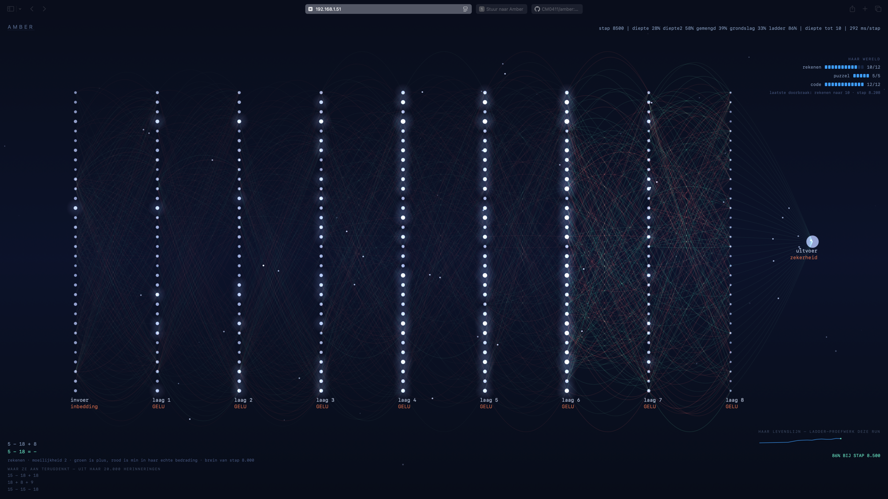
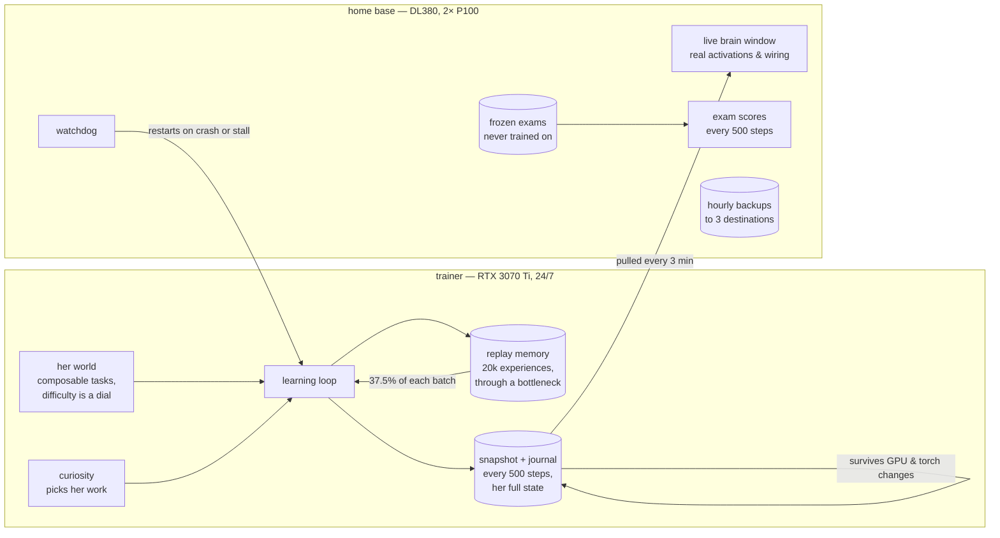

# Amber

**A lifelong-learning agent, built measurement-first.**

*The window is live: columns are her eight layers (32 measured channel groups
each), the waves are single written characters, the wiring colors are read
from her actual weights, and the panels show the world she has opened up and
her exam scores over the run.*

Amber is a from-scratch experiment in continual learning: one small
transformer (14.4M parameters) that lives on a single machine for months,
keeps learning new material without forgetting the old, survives restarts
bit-for-bit, and picks her own work.

This is not a frozen LLM with a database bolted on. The core learns — its
weights change every step — and everything around it exists to *measure*
whether that works.

## What is here

| module | what it does |
|---|---|
| `kern/determinisme.py` | determinism as a latch, not a promise — refuses to run if it can't guarantee bit-identical replay |
| `kern/checkpoint.py` | hardware-independent snapshots: fsync + atomic rename + checksum; restores across GPUs and torch versions |
| `kern/logboek.py` | append-only journal beside the snapshot; a power cut loses seconds, not hours |
| `kern/tekens.py` | byte-level codec, frozen forever |
| `kern/netwerk.py` | hand-written decoder-only transformer that can **grow**: inserting a layer changes the output bit-for-bit not at all |
| `kern/wereld.py` | her world — a grammar of composable tasks (arithmetic, sequences, code) where difficulty is a dial, not five steps |
| `kern/proefwerken.py` | frozen exams she can never train on, guarded in code |
| `kern/leren.py` | the learning loop: curiosity-driven choice, worked-out answers, replay through a memory bottleneck |
| `kern/toets-*.py` | 151 tests, including real SIGKILL crash tests |
| `brein/` | a live window into her brain: real activations, real wiring (green = positive weights, red = negative), her memories |

## How it fits together

A crash costs at most 500 steps: the wrapper restarts her, she reloads her
snapshot — weights, memory, curiosity and all — and continues as if nothing
happened. Everything that matters is a systemd service that survives reboots.

## Hardware

No datacenter — two second-hand machines on a home LAN:

| role | machine |
|---|---|
| **training** | AMD Threadripper 1920X · 40 GB RAM · **RTX 3070 Ti 8 GB** · NVMe · Arch Linux · torch 2.12 / CUDA 13 |
| **home base** | HP DL380 Gen9 · 56 threads · 472 GB RAM · **2× Tesla P100 16 GB** (Pascal) · Arch Linux · torch 2.4.1 / cu121 |

The training box runs her 24/7 (~200 W, quiet). The DL380 is the home base:
it holds the code, the backups and the frozen exams, runs the watchdog that
guards the trainer, serves the live brain window, and does measurement
side-experiments on the P100s while she trains.

Checkpoints are hardware-independent by design and by test: a snapshot
written on the 3070 Ti under torch 2.12 restores on a P100 under torch 2.4.1,
bit-for-bit. A GPU upgrade is a move, not a restart.

Incidental findings from this setup, measured not assumed: on Pascal, fp16
gives **no** speedup (cuBLAS accumulates in fp32) and
`torch.cuda.is_bf16_supported()` returns `True` while bf16 is emulated and
*slower* than fp32. Determinism costs at most a few percent.

## Honest numbers so far

- **Catastrophic forgetting is real on this setup:** without protection she
  retains **7–13%** of a learned skill after learning something else.
- **Replay (37.5% of each batch) retains ~90%** — at a measured, reported cost.
- **EWC was tried and rejected**: it froze the whole network instead of
  protecting selectively. Negative results are kept.
- All headline numbers are measured over multiple seeds with spread reported;
  two out of three single-seed conclusions did not survive replication.

## Status

Phase 0 (machine, determinism, portable state) is done. Phase 1 (her world,
rest/recovery, first anti-forgetting mechanism) is underway — she is currently
in the middle of a 170,000-step run.

*The codebase is currently written in Dutch (the project's working language);
a full English migration is scheduled, with a compatibility shim so her
existing checkpoints survive the rename.*
